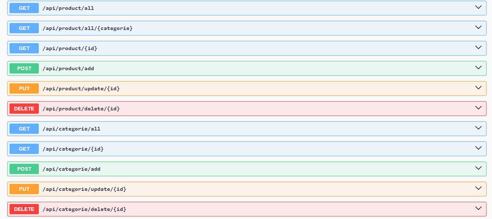

# Api de Product

## 📋 <a name="table">Sommaire</a>

1. [Introduction](#introduction)
2. [Tech Stack](#tech-stack)
3. [Quick Start](#quick-start)
4. [API REST Exportées](#api-rest-exportées)


## <a name="introduction"> 1 - Introduction</a>
Un Back-End simple de gestion des produits (CRUD) en utilise Node.js , Express , Mysql , Sequelize et Swagger

## <a name="tech-stack"> 2 - Tech Stack</a>

- Node.js
- Express
- MySql2
- sequelize
- swagger-ui-express
- swagger-autogen


## <a name="quick-start"> 3 - Quick Start</a>


### Cloning the Repository

```bash
git clone https://github.com/HoussamBouajjioune/API-Produit.git
cd API-Produit
```

### Project setup

Installez les dépendances du projet en utilisant npm :

#### Install
```
npm install
```

#### Run
```
node server.js
```

Ouvrez [http://localhost:3000](http://localhost:3000) dans votre navigateur ou postman(recommander).


## <a name="api-rest-exportées"> 4 - API REST Exportées</a>
Ouvrez [http://localhost:3000/api-docs](http://localhost:3000/api-docs) dans votre navigateur pour découvrir également les API de manipulation

